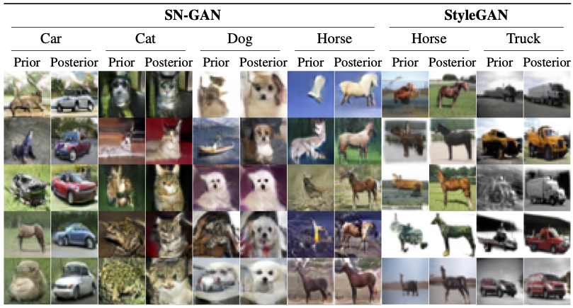

# Data-to-Energy Stochastic Dynamics

<p align="center">
    🌐 <a href="https:" target="_blank">Website</a> | 📃 <a href="https://arxiv.org/abs/" target="_blank">Paper</a>  <br>
</p>

<p align="center">
  
</p>

---
> **Data-to-Energy Stochastic Dynamics**<br>
> Kirill Tamogashev & Nikolay Malkin<br><br>
>**Abstract:** The Schrödinger bridge problem is concerned with finding a stochastic dynamical system bridging two marginal distributions that minimises a certain transportation cost. This problem, which represents a generalisation of optimal transport to the stochastic case, has received attention due to its connections to diffusion models and flow matching, as well as its applications in the natural sciences. However, all existing algorithms allow to infer such dynamics only for cases where samples from both distributions are available.  In this paper, we propose the first general method for modelling Schrödinger bridges when one (or both) distributions are given by their unnormalised densities, with no access to data samples. Our algorithm relies on a generalisation of the iterative proportional fitting (IPF) procedure to the data-free case, inspired by recent developments in off-policy reinforcement learning for training of diffusion samplers. We demonstrate the efficacy of the proposed *data-to-energy IPF* on synthetic problems, finding that it can successfully learn transports between multimodal distributions.  As a secondary consequence of our reinforcement learning formulation, which assumes a fixed time discretisation scheme for the dynamics, we find that existing data-to-data Schrödinger bridge algorithms can be substantially improved by learning the diffusion coefficient of the dynamics. Finally, we apply the newly developed algorithm to the problem of sampling posterior distributions in latent spaces of generative models, thus creating a data-free image-to-image translation method.

## Table of Contents

* [Project structure](#️-installation)
* [Installation](#️-installation)
* [2D experiments](#-2d-experiments)
* [Image experiments](#-image-experiments)
* [Citation](#-citation)
---

## Project structure
```
energy-sb/
├── 📜 configs/           # Hydra experiment configs
├── 🖼️ assets/            # Static assets like images, plots, tables
├── 🐍 sb/                # Main source code for the Schrödinger Bridge package
│   ├── data/             # Data modules
│   ├── buffers/          # Replay buffers for off-policy training
│   ├── losses/           # Loss functions
│   ├── nn/               # Neural network architectures
│   ├── samplers/         # Core training loops and logic
│   └── ...
├── 🚀 py_scripts/        # Executable Python scripts for training and generation
│   ├── train.py
│   └── ...
├── 셸 sh_scripts/         # Shell scripts for running experiments
│   └── ...
├── 🧪 tests/             # Unit and integration tests
├── 📄 pyproject.toml     # Project configuration and dependencies
└── 📖 README.md          # Project overview and documentation
```


## Installation

Here's how you can install this repository and reproduce the experiments

* Python 3.11+
* We use [uv](https://docs.astral.sh/uv/) package manager

```bash
# This example assumes that uv is installed. 
# If not, follow the link above to install it or use a package mangaer of your choice.

# 1. Clone the repository into a folder named 'sb' and navigate into it
git clone git@github.com:mmacosha/energy-sb.git sb
cd sb

# 2. Check out the specific branch for the ICLR 2026 version
git checkout iclr-2026

# 3. Create a virtual environment using Python 3.11 with uv
uv venv -n sbenv --python 3.11

# 4. Activate the newly created virtual environment
source ./sbenv/bin/activate

# 5. Install the project and all its dependencies in editable mode
pip install -e .
```

## 2D Experiments
To reproduce 2D experiments you should just to run the scripts located in `sh-scripts/...'. For example:
```bash
./sh_scripts/d2d-benchmarks/ablate-d2d-normal_to_gmm.sh 1
```
All the experiments suppot `cpu`, `mps` and `cuda` training.

## Image experiments
To reproduce image experiments you would need to install the following models
1. [SN-GAN](https://github.com/GongXinyuu/sngan.pytorch)
2. [StyleGAN](https://github.com/NVlabs/stylegan3)
3. [CIFAR-10 Classifier](https://github.com/huyvnphan/PyTorch_CIFAR10)
<!-- 4. [CelebA Classifier]() -->

All models should be installed into the `sb/external`

The experiment can be run as follows: 
```bash
train --cfg=sb-sg --device=0 --wandb=online --name=EXPERIMENT-NAME \
      --overrides="data.p_1.args.target_classes=[5],sampler.off_policy_fraction=0.8"
```

## Citation
Please, cite this work as follows
```
@misc{tamogashev@d2edynamics,
    author    = {Kirill, Tamogashev and Nikolay, Malkin},
    title     = {Data-to-Energy Stochastic dynamics},
    year      = {2025},
    notes     = {Submitted to ICLR 2026.}
}
```